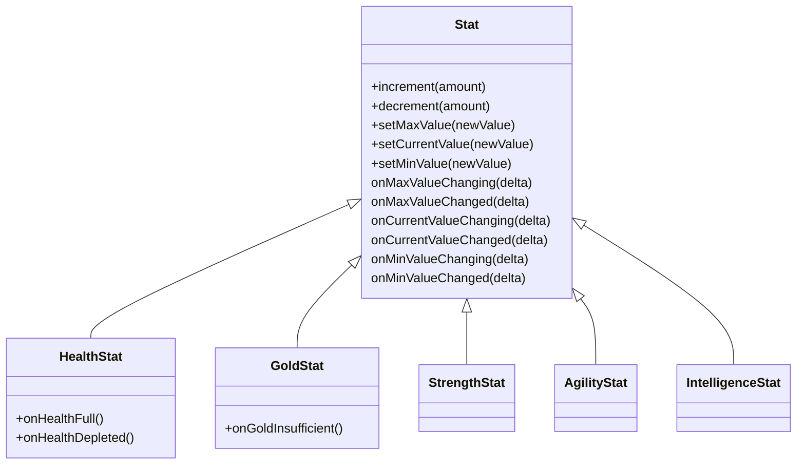

## Stat system

```mermaid
classDiagram
    class Stat
    Stat: +increment(amount)
    Stat: +decrement(amount)
    Stat: +setMaxValue(newValue)
    Stat: +setCurrentValue(newValue)
    Stat: +setMinValue(newValue)
    Stat: onMaxValueChanging(delta)
    Stat: onMaxValueChanged(delta)
    Stat: onCurrentValueChanging(delta)
    Stat: onCurrentValueChanged(delta)
    Stat: onMinValueChanging(delta)
    Stat: onMinValueChanged(delta)

    class HealthStat
    Stat <|-- HealthStat
    HealthStat: +onHealthFull()
    HealthStat: +onHealthDepleted()

    class GoldStat
    Stat <|-- GoldStat
    GoldStat: +onGoldInsufficient()

    class StrengthStat
    Stat <|-- StrengthStat

    class AgilityStat
    Stat <|-- AgilityStat

    class IntelligenceStat
    Stat <|-- IntelligenceStat
```